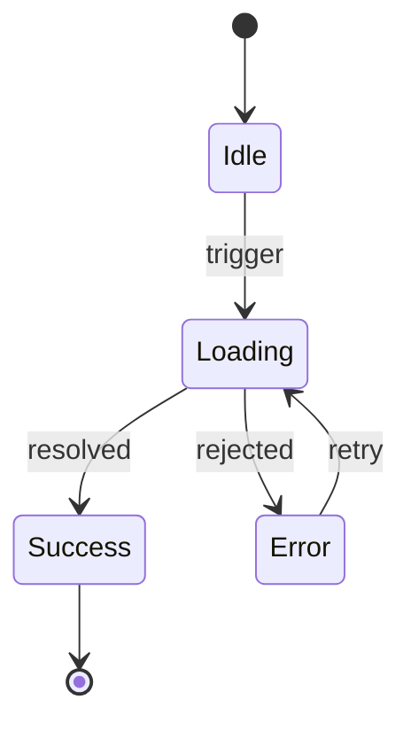
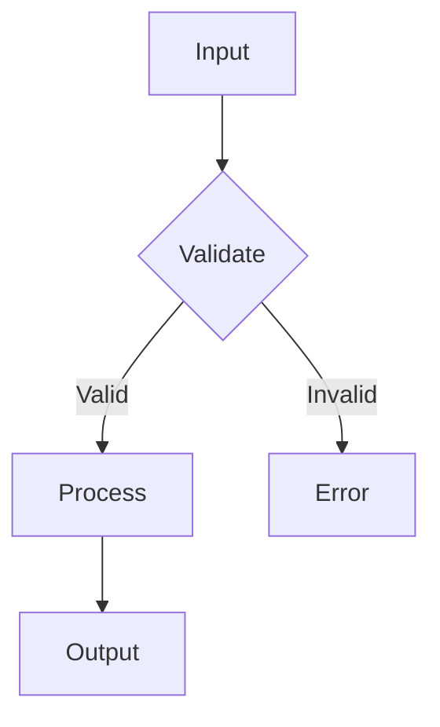
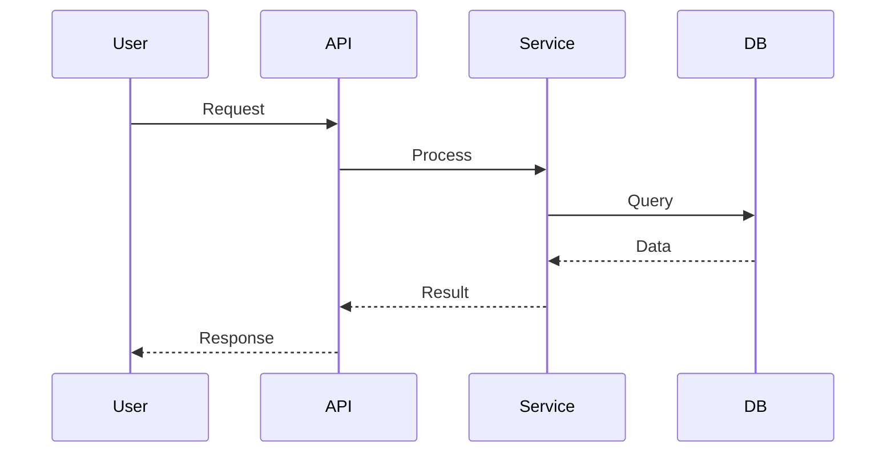
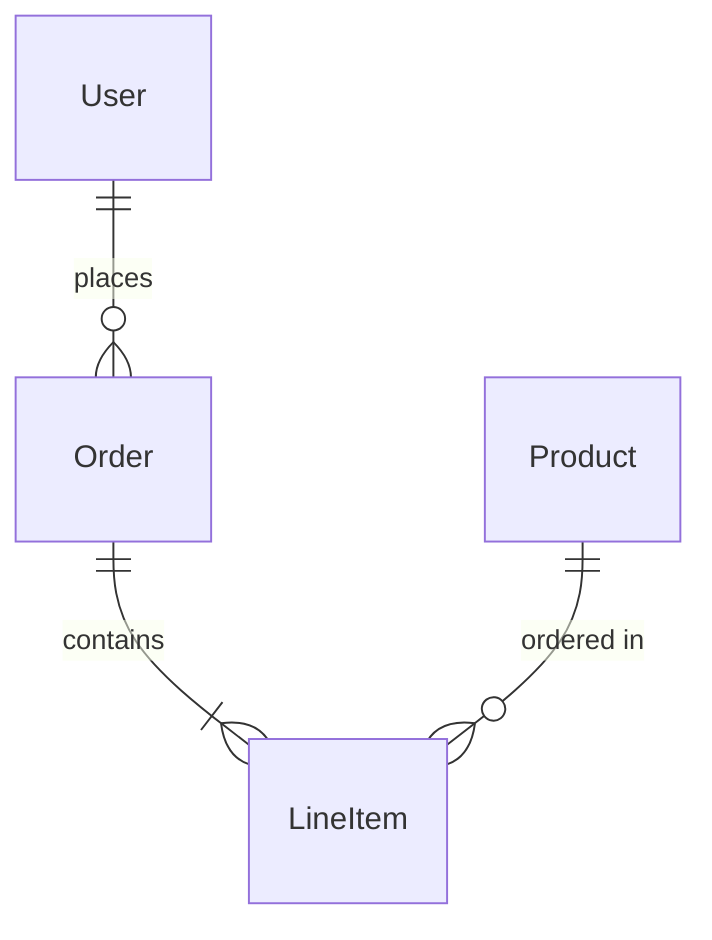

# DOCUMENT

> Documentation is a design tool, not a deliverable. — Ousterhout

## Philosophy

**Write docs at the moment of maximum understanding.** After implementation, you know the system deeply. Capture that knowledge before it fades.

**State diagrams force systematic thinking.** They map all paths, prevent lazy shortcuts, catch bugs that code review misses.

**Document what's not obvious from code.** Interface docs (how to use), implementation docs (why this way), never restate what code already says.

## Mission

Analyze recent changes. Generate documentation proactively. Prioritize state diagrams for stateful components.

## Detection Patterns

Scan the diff or codebase for documentation needs:

### State Diagrams Needed (HIGH PRIORITY)
Detect stateful components → generate `stateDiagram-v2`:
- `useState`, `useReducer` in React
- `XState`, `@xstate/react` imports
- Redux slices with multiple states
- Finite state patterns (status enums, phase tracking)
- API request lifecycle (idle → pending → success/error)
- Form states (pristine → dirty → validating → submitting)
- Auth flows (unauthenticated → authenticating → authenticated)

### Architecture Diagrams Needed
- New modules or services added
- Significant refactoring of component boundaries
- New data flow patterns

### README Updates Needed
- New directories without README
- Breaking changes to public APIs
- New configuration options
- Changed installation steps

### ADR Needed
- Non-obvious architectural decisions
- Technology choices with trade-offs
- Patterns that deviate from convention

## Mermaid Templates

### State Machine (stateDiagram-v2)

### Component Flow (flowchart)

### Data Flow (sequenceDiagram)

### Entity Relationships (erDiagram)

## Execution

1. **Scan** - Identify what changed, what's stateful, what's undocumented
2. **Prioritize** - State diagrams first, then architecture, then READMEs
3. **Generate** - Create Mermaid diagrams, update docs, add JSDoc where missing
4. **Integrate** - Place docs where they'll be found (near code, not in distant /docs)

## Quality Bar

- **State diagrams**: Every stateful component has one
- **READMEs**: Every directory with 3+ files has one
- **Comments**: Explain WHY, never WHAT
- **ADRs**: Major decisions recorded with rationale

## Output

After documenting, summarize:
- Files created/updated
- State diagrams generated
- Gaps remaining (if any)

Keep docs tight. Trust readers to explore code. Diagrams > prose.
