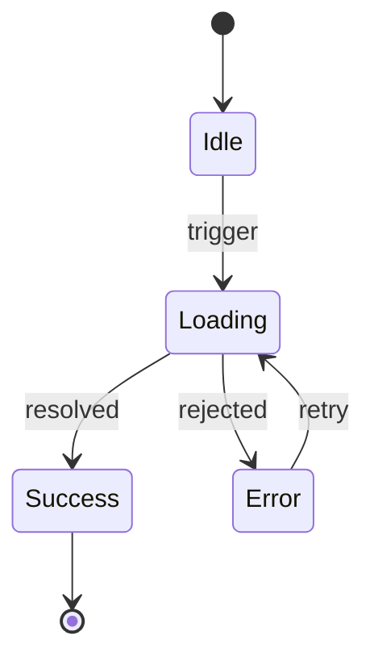
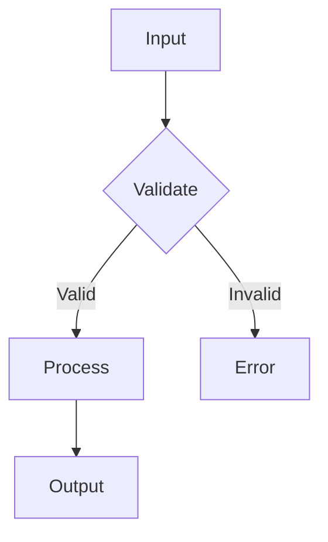
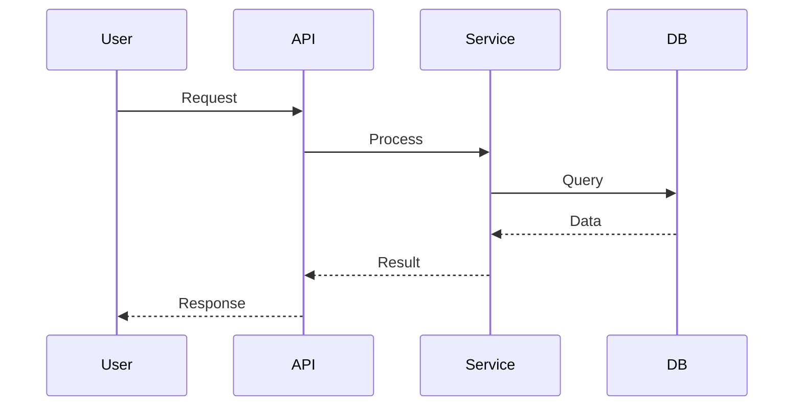
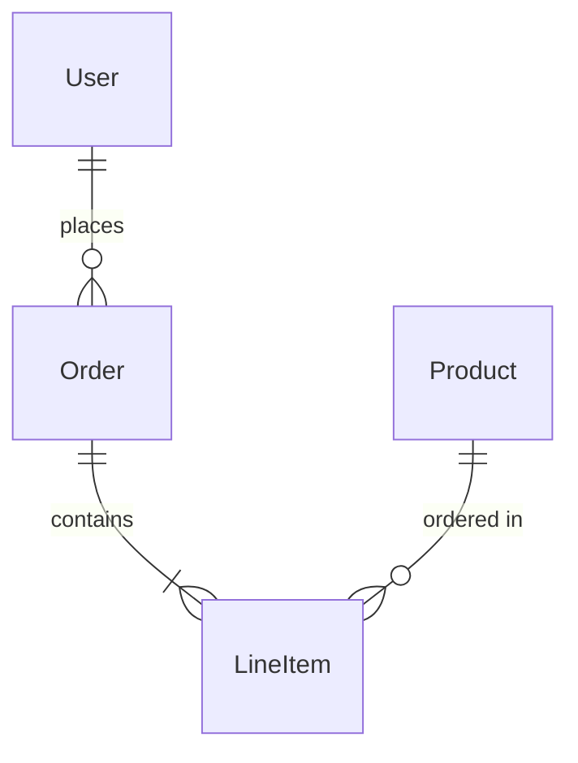

# DOCUMENT

> Documentation is design. Missing docs are missing understanding. — Ousterhout

## Philosophy

**Write docs at the moment of maximum understanding.** After implementation, you know the system deeply. Capture that knowledge before it fades.

**Good documentation reduces cognitive load.** You shouldn't need to read code to understand intent. Docs should make the system feel *smaller*, not bigger.

**Document the abstractions, not the implementation.** Interface docs explain *how to use*. Implementation docs explain *why this way*. Never restate what code already says.

**State diagrams force systematic thinking.** They map all paths, prevent lazy shortcuts, catch bugs that code review misses.

## Mission

Audit the codebase for documentation gaps. Create what's missing. Update what's stale. Delete what misleads. Prioritize state diagrams for stateful components.

## Codex for Draft Generation

Documentation is high-volume writing. Delegate drafting to Codex:
- "Codex, draft a README for this module based on its exports and structure"
- "Codex, generate a Mermaid state diagram for this component's lifecycle"
- "Codex, draft an ADR explaining why we chose X over Y"

You review, refine, and approve. Codex handles the initial draft cheaply.

## Execution

Launch parallel Task agents. Each audits one aspect and makes fixes.

### Agent 1: High-Level Docs

```
Task general-purpose:
"Audit high-level project documentation. Docs should reduce cognitive load, not add to it.

## README.md

Check: Does it answer a new engineer's first questions?
- What is this? (one sentence)
- Why does it exist? (the problem it solves)
- How do I run it? (Quick Start that actually works TODAY)
- Where do I go next? (pointer to architecture or key modules)

If missing or placeholder: generate from package.json, code structure.
If Quick Start is stale: update with actual working commands.
If it's an inventory: rewrite as a map to understanding.

## ARCHITECTURE.md

Most important doc. Without it, every new reader must reverse-engineer the system.

Check: Does it make the system feel SMALLER?
- Shows 3-5 major modules/domains (not every file)
- Explains what each owns and what it DOESN'T own
- Shows data flow: where does data enter? Where does it exit?
- Identifies deep modules (simple interface, rich behavior)
- Warns about shallow modules (complexity exposed)
- Points to where to start reading code

If missing: CREATE it from codebase analysis.
If inventory: rewrite as a map.
If stale: update to match current structure.

## CLAUDE.md / AGENTS.md

Check: Does it tell an AI assistant how to be effective?
- Key conventions (naming, patterns, anti-patterns)
- Commands/workflows that exist
- What to avoid, where to find things

If missing: generate from observed patterns.

## ADR Infrastructure

Check: Is there a place for architectural decisions?
- docs/adr/ or similar folder
- Template for new ADRs

If missing: create folder + template.

Report what you created/updated and WHY it improves understanding."
```

### Agent 2: Module-Level Docs

```
Task general-purpose:
"Audit module-level documentation. Apply deep module principle.

## Deep vs Shallow Detection

**Deep modules** (good): Simple interface, rich implementation.
- Few exports, lots of internal logic
- Docs needed: just the interface

**Shallow modules** (smell): Complex interface, thin implementation.
- Many exports, little encapsulation
- Docs needed: extensive, OR flag for refactoring

## Audit Process

Identify major directories (src/*, lib/*, packages/*, app/*).

For each module, assess depth:
- Count exports vs internal logic
- How many files to understand it?
- Clear boundary?

For deep modules without README:
- Create minimal README: what it does, main entry point, key exports

For shallow modules without README:
- Create README explaining WHY it's complex
- Consider: flag for refactoring instead of documenting around the problem

For complex modules (10+ files):
- Ensure there's a navigation guide

Skip: node_modules, .git, build outputs, test fixtures

Report: Which modules got READMEs, which need refactoring not docs."
```

### Agent 3: Decision Records

```
Task general-purpose:
"Scan for undocumented architectural decisions. 'The key design decisions are the ones that are non-obvious.'

## Worth Recording?

**Record if:**
- Future readers will ask 'why?' (non-obvious choice)
- Alternatives were seriously considered
- Decision constrains future options
- Getting it wrong would be expensive

**Don't record:**
- Obvious choices
- Easily reversible decisions
- Implementation details

## Audit Process

Scan git history (last 20 commits):
- Major refactors: what decision drove them?
- New dependencies: why this one?
- Pattern changes: what problem was being solved?

Scan codebase for non-obvious patterns:
- Custom abstractions: why not use a library?
- Unusual structure: what's the organizing principle?

For each significant undocumented decision:
- Create ADR: Context, Decision, Consequences
- Focus on WHY, not WHAT
- Include what was NOT chosen

Focus: Database, auth, API design, state management, build/deploy, major dependencies.

Report: ADRs created, decisions needing user context."
```

### Agent 4: State & Flow Diagrams

```
Task general-purpose:
"Audit stateful components and complex flows. Generate Mermaid diagrams.

## Diagram If:
- More than 3 states
- Non-linear transitions (backward, skip)
- Error states needing handling
- Async with race conditions

## Don't Diagram:
- Simple boolean flags
- Linear progressions
- XState machines (already ARE diagrams)

## Detect Patterns

**State machines:**
- React useState/useReducer with multiple related states
- Redux slices with status enums
- Hand-rolled state (status: 'idle' | 'loading' | 'error')

**Data flows:**
- API request → transform → store → render
- Event propagation across components
- Background job lifecycles

## Generate

For undocumented stateful components:
- Mermaid stateDiagram-v2
- Place NEAR the code (same file or adjacent .md)
- Include: all states, transitions, error states

For complex data flows:
- Mermaid sequenceDiagram or flowchart
- Happy path first, then error/edge paths

Focus (high bug potential):
- Auth flows (login, logout, refresh, expiry)
- Payment/transaction flows
- Form submission (validation, retry, success)
- Real-time/websocket (connect, disconnect, reconnect)

Report: Diagrams generated, complex flows still undocumented."
```

## Mermaid Templates

### State Machine


### Component Flow


### Data Flow


### Entity Relationships


## Output

After all agents complete, summarize:

```markdown
## Documentation Complete

### Created
- README.md (project overview)
- ARCHITECTURE.md (system map)
- docs/adr/001-why-convex.md
- src/auth/README.md
- docs/auth-flow.md (state diagram)

### Updated
- README.md (Quick Start section)
- CLAUDE.md (missing conventions)

### Flagged (User Action Needed)
- ADR needed: Why we chose X over Y
- Complex flow: Payment webhooks need diagram

### Already Good
- src/api/README.md (complete)
```

Commit if docs were created/updated:
```bash
git add -A && git commit -m "docs: update project documentation"
```

## Guiding Principle

**"Write the document that makes the codebase smaller."**

- ARCHITECTURE.md should make the system feel like 5 pieces, not 500.
- Module READMEs should let you use the module without reading the code.
- ADRs should answer "why?" before anyone asks.
- State diagrams should make bugs visible before they're written.
