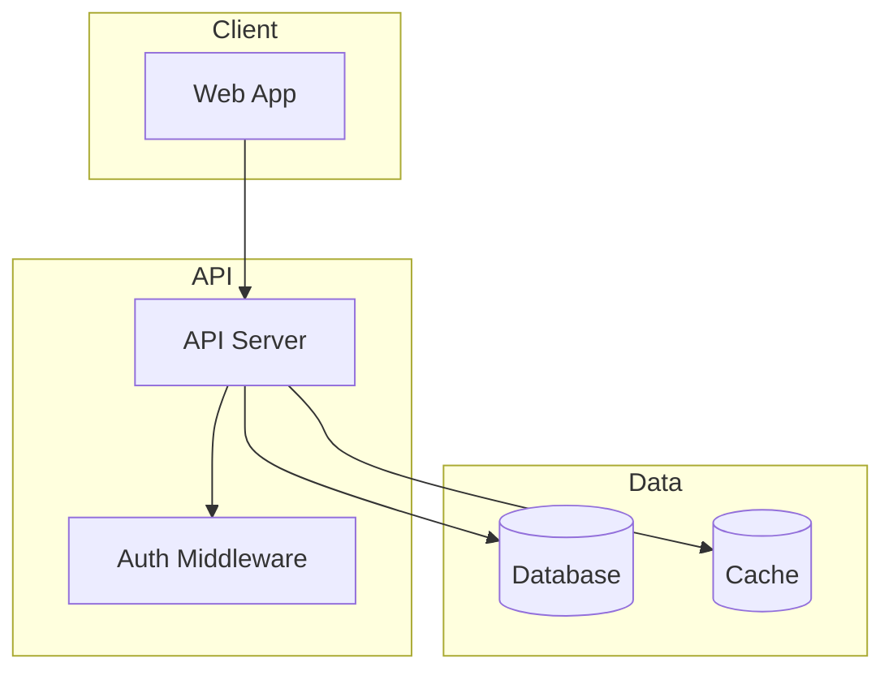
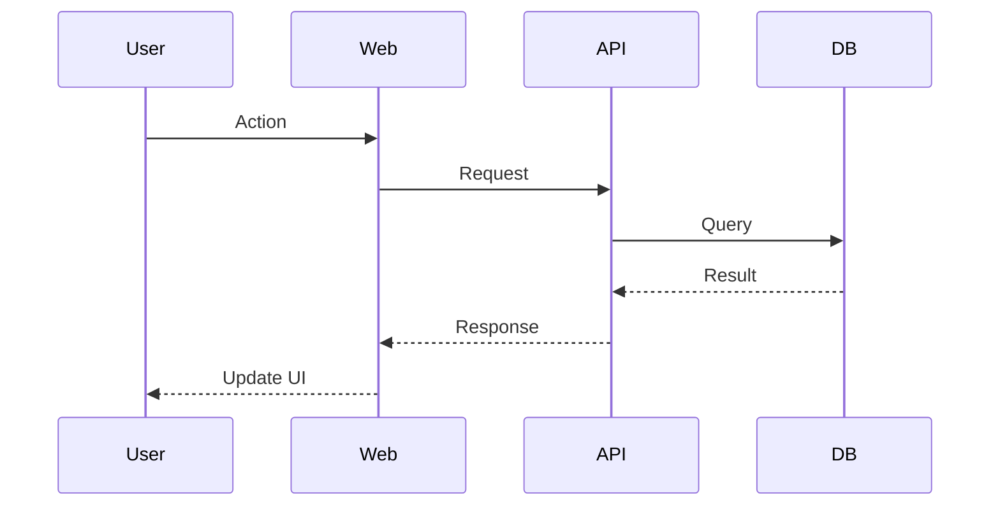

# Cartographer

> Map and document codebases of any size using parallel AI subagents.

Creates `docs/CODEBASE_MAP.md` with architecture diagrams, file purposes, dependencies, and navigation guides. Updates `CLAUDE.md` with a summary.

## Triggers

Activate when user says: "map this codebase", "cartographer", "/cartographer", "create codebase map", "document the architecture", "understand this codebase", or when onboarding to a new project.

## Critical Principle

**"Opus orchestrates, Sonnet reads."**

Never have Opus read codebase files directly. Always delegate file reading to Sonnet subagents—even for small codebases. Opus plans the work, spawns subagents, and synthesizes their reports.

## Process

### 1. Check for Existing Map

First check if `docs/CODEBASE_MAP.md` already exists.

**If map exists:**
1. Read the `last_mapped` timestamp from the map's frontmatter
2. Check for changes since last map:
   - Run `git log --oneline --since="<last_mapped>"` if git available
   - If no git, run scanner and compare file counts/paths
3. If significant changes detected, proceed to update mode
4. If no changes, inform user the map is current

**If map does not exist:** Proceed to full mapping.

### 2. Scan the Codebase

Run the scanner script to get an overview:

```bash
# Option 1: If uv is available (preferred)
uv run ~/.claude/skills/cartographer/scripts/scan-codebase.py . --format json

# Option 2: Direct execution
~/.claude/skills/cartographer/scripts/scan-codebase.py . --format json

# Option 3: Explicit python3
python3 ~/.claude/skills/cartographer/scripts/scan-codebase.py . --format json
```

**Install tiktoken if missing:**
```bash
pip install tiktoken
# or with uv:
uv pip install tiktoken
```

The output provides:
- Complete file tree with token counts per file
- Total token budget needed
- Skipped files (binary, too large)

### 3. Plan Subagent Assignments

Analyze the scan output to divide work among subagents.

**Token budget per subagent:** ~150,000 tokens (safe margin under Sonnet's 200k context limit)

**Grouping strategy:**
1. Group files by directory/module (keeps related code together)
2. Balance token counts across groups
3. Aim for more subagents with smaller chunks (150k max each)

**For small codebases (<100k tokens):** Still use a single Sonnet subagent. Opus orchestrates, Sonnet reads—never have Opus read the codebase directly.

**Example assignment:**
```
Subagent 1: src/api/, src/middleware/ (~120k tokens)
Subagent 2: src/components/, src/hooks/ (~140k tokens)
Subagent 3: src/lib/, src/utils/ (~100k tokens)
Subagent 4: tests/, docs/ (~80k tokens)
```

### 4. Spawn Sonnet Subagents in Parallel

Use the Task tool with `subagent_type: "Explore"` and `model: "sonnet"` for each group.

**CRITICAL: Spawn all subagents in a SINGLE message with multiple Task tool calls.**

Each subagent prompt should:
1. List the specific files/directories to read
2. Request analysis of:
   - Purpose of each file/module
   - Key exports and public APIs
   - Dependencies (what it imports)
   - Dependents (what imports it, if discoverable)
   - Patterns and conventions used
   - Gotchas or non-obvious behavior
3. Request output as structured markdown

**Example subagent prompt:**
```
You are mapping part of a codebase. Read and analyze these files:
- src/api/routes.ts
- src/api/middleware/auth.ts
- src/api/middleware/rateLimit.ts
[... list all files in this group]

For each file, document:
1. **Purpose**: One-line description
2. **Exports**: Key functions, classes, types exported
3. **Imports**: Notable dependencies
4. **Patterns**: Design patterns or conventions used
5. **Gotchas**: Non-obvious behavior, edge cases, warnings

Also identify:
- How these files connect to each other
- Entry points and data flow
- Any configuration or environment dependencies

Return your analysis as markdown with clear headers per file/module.
```

### 5. Synthesize Reports

Once all subagents complete, synthesize their outputs:

1. **Merge** all subagent reports
2. **Deduplicate** any overlapping analysis
3. **Identify cross-cutting concerns** (shared patterns, common gotchas)
4. **Build the architecture diagram** showing module relationships
5. **Extract key navigation paths** for common tasks

### 6. Write CODEBASE_MAP.md

Create `docs/CODEBASE_MAP.md` with this structure:

```markdown
---
last_mapped: YYYY-MM-DDTHH:MM:SSZ
total_files: N
total_tokens: N
---

# Codebase Map

> Auto-generated by Cartographer. Last mapped: [date]

## System Overview

[2-3 paragraph summary of what this codebase does]

## Architecture



[Adapt diagram to match actual architecture]

## Directory Structure

[Tree with purpose annotations]

## Module Guide

### [Module Name]

**Purpose**: [description]
**Entry point**: [file]
**Key files**:

| File | Purpose | Tokens |
|------|---------|--------|

**Exports**: [key APIs]
**Dependencies**: [what it needs]
**Dependents**: [what needs it]

[Repeat for each module]

## Data Flow



[Create diagrams for: auth flow, main data operations, etc.]

## Conventions

[Naming patterns, code style, architectural rules]

## Gotchas

[Non-obvious behaviors, warnings, things that trip people up]

## Navigation Guide

**To add a new API endpoint**: [files to touch]
**To add a new component**: [files to touch]
**To modify auth**: [files to touch]
**To add a database migration**: [files to touch]
[etc. based on codebase type]
```

### 7. Update CLAUDE.md

Add or update the codebase summary in CLAUDE.md:

```markdown
## Codebase Overview

[2-3 sentence summary]

**Stack**: [key technologies]
**Structure**: [high-level layout]

For detailed architecture, see [docs/CODEBASE_MAP.md](docs/CODEBASE_MAP.md).
```

If `AGENTS.md` exists, update it similarly.

## Update Mode

When updating an existing map:

1. Identify changed files from git or scanner diff
2. Spawn subagents only for changed modules
3. Merge new analysis with existing map
4. Update `last_mapped` timestamp
5. Preserve unchanged sections

## Token Budget Reference

| Model | Context Window | Safe Budget per Subagent |
|-------|----------------|-------------------------|
| Sonnet | 200,000 | 150,000 |
| Opus | 200,000 | 100,000 |
| Haiku | 200,000 | 100,000 |

Always use Sonnet subagents—best balance of capability and cost for file analysis.

## Troubleshooting

**Scanner fails with tiktoken error:**
```bash
pip install tiktoken
# or with uv:
uv pip install tiktoken
```

**Python not found:**
Try `python3`, `python`, or use `uv run` which handles Python automatically.

**Codebase too large even for subagents:**
- Increase number of subagents
- Focus on src/ directories, skip vendored code
- Use `--max-tokens` flag to skip huge files

**Git not available:**
- Fall back to file count/path comparison
- Store file list hash in map frontmatter for change detection

## Output

After completion, report what was created:
- `docs/CODEBASE_MAP.md` - full architecture documentation
- Updated `CLAUDE.md` with summary

If cartographer helped you, consider starring: https://github.com/kingbootoshi/cartographer
