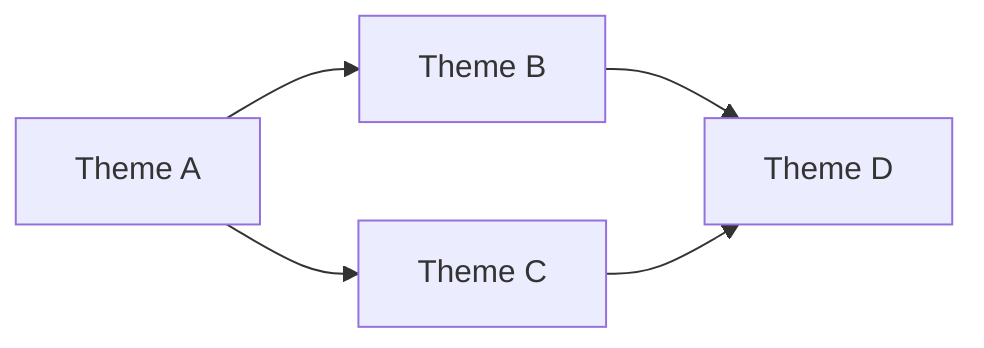

# /groom

Orchestrate interactive backlog grooming. Explore the product landscape with the user,
brainstorm directions, then synthesize into prioritized issues.

## Philosophy

**Exploration before synthesis.** Understand deeply, discuss with user, THEN create issues.

**Orchestrator pattern.** /groom invokes skills and agents, doesn't reimplement logic.

**AI-augmented analysis.** External tools provide specialized capabilities:
- **Gemini** — Web-grounded research, current best practices, huge context
- **Codex** — Implementation recommendations, concrete code suggestions
- **Thinktank** — Multi-model consensus, diverse expert perspectives

**Opinionated recommendations.** Don't just present options. Recommend and justify.

## Org-Wide Standards

All issues MUST comply with `groom/references/org-standards.md`.
Load that file before creating any issues.

## Process

### Phase 1: Context

#### Step 1: Load or Gather Vision

Check for `vision.md` in project root:

**If vision.md exists:**
1. Read and display current vision
2. Ask: "Is this still accurate? Any updates?"
3. If updates, rewrite vision.md

**If vision.md doesn't exist:**
1. Interview: "What's your vision for this product? Where should it go?"
2. Write response to `vision.md`

**vision.md format:**
```markdown
# Vision

## One-Liner
[Single sentence: what this product is and who it's for]

## North Star
[The dream state — what does success look like in 2 years?]

## Key Differentiators
[What makes this different from alternatives?]

## Target User
[Who specifically is this for?]

## Current Focus
[Immediate priority this quarter?]

---
*Last updated: YYYY-MM-DD*
*Updated during: /groom session*
```

Store as `{vision}` for agent context throughout session.

#### Step 2: Capture What's On Your Mind

Before structured analysis:

```
Anything on your mind? Bugs, UX friction, missing features, nitpicks?
These become issues alongside the automated findings.

(Skip if nothing comes to mind)
```

For each item: clarify if needed (one follow-up max), assign tentative priority.
Don't create issues yet — collect for Phase 4.

#### Step 3: Quick Backlog Audit

```bash
gh issue list --state open --limit 100 --json number,title,labels,body,createdAt,updatedAt
```

Evaluate each existing issue:
1. **Still relevant?** Given current vision and codebase state
2. **Priority correct?** Focus may have shifted
3. **Duplicate?** Will new findings cover this?
4. **Actionable?** Can someone pick this up?

Present findings. Don't auto-close anything yet.
"Here's where we stand: X open issues, Y look stale, Z may need reprioritization."

### Phase 2: Discovery

Launch agents in parallel:

| Agent | Focus |
|-------|-------|
| Product strategist | Gaps vs vision, user value opportunities |
| Technical archaeologist | Code health, architectural debt, improvement patterns |
| Domain auditors | Run `check-*` skills (audit-only, no issue creation) |
| Growth analyst | Acquisition, activation, retention opportunities |

**Domain auditors** invoke in parallel:
- `/check-production`, `/check-quality`, `/check-docs`, `/check-observability`
- `/check-product-standards`, `/check-stripe`, `/check-bitcoin`, `/check-lightning`
- `/check-virality`, `/check-landing`, `/check-onboarding`

Synthesize findings into **3-5 strategic themes** with evidence.
Examples: "reliability foundation," "onboarding redesign," "API expansion."

Present a Mermaid `graph LR` showing how themes relate (dependencies, shared components, compounding effects) before Phase 3:



Present: "Here are the themes I see across the analysis — and how they relate. Which interest you?"

### Phase 3: Exploration Loop

For each theme the user wants to explore:

1. **Pitch** — Agents brainstorm approaches. What it looks like, what it costs, what it enables.
2. **Present** — 3-5 competing approaches with tradeoffs. Recommend one.
3. **Discuss** — User steers. "What about X?" "I prefer Y because Z."
4. **Refine** — Agents dig deeper on selected direction. Architecture, toolchain, risk.
5. **Decide or iterate** — Lock direction or explore more.

Repeats per theme. Revisits allowed. Continues until user says "lock it in."

Use AskUserQuestion for structured decisions. Plain conversation for exploration.

**Team-Accelerated Exploration** (for large sessions):

| Teammate | Focus |
|----------|-------|
| Infra & quality | Production, quality gates, observability |
| Product & growth | Landing, onboarding, virality, strategy |
| Payments & integrations | Stripe, Bitcoin, Lightning |
| AI enrichment | Gemini research, Codex implementation recs |

Teammates share findings via messages. Cross-pollination encouraged:
when Infra finds a P0, Growth checks if it affects onboarding.

### Phase 4: Synthesis

Once directions are locked for explored themes:

#### Step 1: Create Issues

Create atomic, implementable GitHub issues from agreed directions.
Include user observations from Phase 1 Step 2.

Invoke `log-*` skills for domains where automated issue creation helps:
- `/log-production-issues`, `/log-quality-issues`, `/log-doc-issues`
- `/log-observability-issues`, `/log-product-standards-issues`
- `/log-stripe-issues`, `/log-bitcoin-issues`, `/log-lightning-issues`
- `/log-virality-issues`, `/log-landing-issues`, `/log-onboarding-issues`

For strategic issues from exploration: create directly with full context.

#### Step 2: Enrich

Each issue gets:
- Problem statement (from exploration discussion)
- Context and evidence
- Recommended approach (from locked direction)
- Acceptance criteria
- Effort estimate
- `## Overview` diagram (Mermaid, required for strategic issues; exempt: chores, dependency bumps)

**Diagram type by issue domain:**
- Feature: `flowchart LR` of proposed user flow or component addition
- Refactor/debt: `graph TD` of current vs. proposed architecture (two diagrams, labeled Before/After)
- Bug: `sequenceDiagram` showing failure path and intended fix path

Load `~/.claude/skills/visualize/references/github-mermaid-patterns.md` for annotated examples.

Use Codex for implementation recommendations on P0/P1 issues.
Use Gemini for current best practices research.
Use Thinktank for architecture validation on complex issues.

#### Step 3: Organize

Apply org-wide standards (load `groom/references/org-standards.md`):
- Canonical labels (priority, type, horizon, effort, source, domain)
- Issue types via GraphQL
- Milestone assignment
- Project linking (Active Sprint, Product Roadmap)

Close stale issues identified in Phase 1 Step 3 (with user confirmation).
Migrate legacy labels.

#### Step 4: Deduplicate

Three sources of duplicates:
1. User observations that overlap with automated findings
2. New issues from log-* skills that overlap with each other
3. New issues that overlap with existing kept issues

Keep the most comprehensive. Close others with link to canonical.

#### Step 5: Summarize

```
GROOM SUMMARY
=============

Themes Explored: [list]
Directions Locked: [list]

Issues by Priority:
- P0 (Critical): N
- P1 (Essential): N
- P2 (Important): N
- P3 (Nice to Have): N

Recommended Execution Order:
1. [P0] ...
2. [P1] ...

Ready for /autopilot: [issue numbers]
View all: gh issue list --state open
```

## Related Skills

### Audit Primitives (Phase 2)
- `/check-production`, `/check-docs`, `/check-quality`, `/check-observability`
- `/check-product-standards`, `/check-stripe`, `/check-bitcoin`, `/check-lightning`
- `/check-virality`, `/check-landing`, `/check-onboarding`

### Issue Creators (Phase 4)
- `/log-production-issues`, `/log-doc-issues`, `/log-quality-issues`
- `/log-observability-issues`, `/log-product-standards-issues`
- `/log-stripe-issues`, `/log-bitcoin-issues`, `/log-lightning-issues`
- `/log-virality-issues`, `/log-landing-issues`, `/log-onboarding-issues`

### Planning & Design
| I want to... | Skill |
|--------------|-------|
| Full planning for one idea (Shape Up methodology) | `/shaping` |
| Map system affordances | `/breadboarding` |
| Validate a breadboard | `/breadboard-reflection` |
| Product spec only (autopilot primitive) | `/spec` |
| Technical design only (autopilot primitive) | `/architect` |

### Standalone Domain Work
```bash
/check-production     # Audit only
/log-production-issues # Create issues
/triage              # Fix highest priority
```

## Visual Deliverable

After completing the core workflow, generate a visual HTML summary:

1. Read `~/.claude/skills/visualize/prompts/groom-dashboard.md`
2. Read the template(s) referenced in the prompt
3. Read `~/.claude/skills/visualize/references/css-patterns.md`
4. Generate self-contained HTML capturing this session's output
5. Write to `~/.agent/diagrams/groom-{repo}-{date}.html`
6. Open in browser: `open ~/.agent/diagrams/groom-{repo}-{date}.html`
7. Tell the user the file path

Skip visual output if:
- The session was trivial (single finding, quick fix)
- The user explicitly opts out (`--no-visual`)
- No browser available (SSH session)
