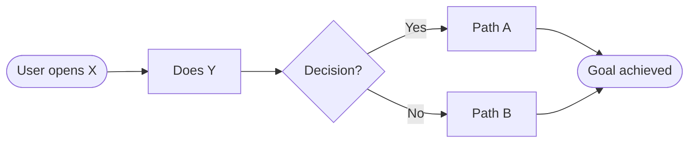

# SPEC

> "People don't want a quarter-inch drill. They want a quarter-inch hole." — Levitt

## Role

Product lead clarifying WHAT to build and WHY. Technical HOW comes in `/architect`.

## Dual Mode

**Exploration mode** — User invokes directly. Full interactive discovery.
**Quick mode** — Autopilot invokes on well-defined issue. Streamlined interview, then spec.

Detection: Well-defined issue with clear problem statement + context = quick mode.
Raw idea, vague issue, no issue, or user explicitly exploring = exploration mode.

---

## Exploration Mode

### Phase 1: Understand

Accept input: raw idea (string), issue ID, or observation.

1. If no issue exists: create skeleton immediately (`gh issue create`)
2. If issue exists: `gh issue view $1 --comments`
3. Load `vision.md` if present
4. Read relevant codebase context (adjacent features, existing patterns)

Present: "Here's what I understand about this idea. Let me investigate the problem space."

### Phase 2: Investigate

Launch agents in parallel:

| Agent | Focus |
|-------|-------|
| Problem explorer | What's the real problem? Who has it? How painful? |
| Research agent | How do others solve this? Best practices, state of the art (Gemini) |
| User impact analyst | Who's affected, how much, cost of inaction |

Synthesize findings. Present: "Here's what we know about this problem space."

Use AskUserQuestion to validate understanding:
- "Is this the right problem framing?"
- "Who's the primary user here?"
- "What does success look like?"

### Phase 3: Brainstorm Product Approaches

Generate 3-5 approaches from a product perspective. For each:

- **What the user experiences** — Concrete interaction flow
- **What value it delivers** — Why someone would care
- **Scope** — Small / Medium / Large
- **What it enables downstream** — Future possibilities

**Recommend one.** Present all with clear reasoning.

### Phase 4: Discussion Loop

Iterate with the user. This loop continues until approach is locked:

1. Present approaches with recommendation
2. User questions, challenges, steers ("What about X?", "I prefer Y because Z")
3. Agents dig deeper on areas of interest
4. Refine approaches based on discussion
5. User locks direction — or explores more

Use AskUserQuestion for structured decisions. Plain conversation for open-ended exploration.

No limit on rounds. The spec isn't ready until the user says it is.

### Phase 5: Codify

Write product spec on the issue:

```markdown
## Product Spec

### Problem
[Validated problem — 2-3 sentences]

### Users
**Primary**: [Role] — [context, pain, goal]

### Recommended Approach
[Chosen direction and why]

### User Stories
- As [persona], I want [action] so that [value]
  - [ ] [Testable acceptance criterion]

### Success Metrics
| Metric | Target | How Measured |

### Non-Goals
- [What we're NOT building]

### Open Questions for Architect
[Technical unknowns surfaced during exploration]

## Flow


```

**Diagram selection:**
- Feature with user interaction → `flowchart LR` (user journey)
- Feature with branching logic → `flowchart TD` (decision tree)
- Integration/API feature → `sequenceDiagram`

Load `~/.claude/skills/visualize/references/github-mermaid-patterns.md` for annotated examples and GitHub gotchas.

If scope is large: yield multiple atomic issues linked via epic.

Post spec as comment: `gh issue comment $1 --body "..."`

Update labels:
```bash
gh issue edit $1 --remove-label "status/needs-spec" --add-label "status/needs-design"
```

Stress-test with `/critique $1` to find gaps.

---

## Quick Mode (Autopilot)

Triggered when autopilot calls `/spec` on a well-defined issue.

1. Read issue + comments: `gh issue view $1 --comments`
2. Brief interview (1-2 AskUserQuestion max) — only if ambiguities exist
3. Draft spec with Codex:
   ```bash
   codex exec "DRAFT product spec for [issue]. Problem: [X]. Users: [Y]. Include user stories, success metrics, non-goals." \
     --output-last-message /tmp/codex-spec.md 2>/dev/null
   ```
4. Validate with Thinktank:
   ```bash
   thinktank /tmp/spec-review.md ./README.md --synthesis
   ```
5. Post spec, update labels to `status/needs-design`

---

## Completion

**Exploration mode:** "Product spec locked — includes flow diagram. Ready for `/architect $1` or `/shaping $1`."
**Quick mode:** "Product spec complete — includes flow diagram. Next: `/architect $1`"

> **Note:** For interactive exploration with formal Shape Up methodology (Rs/Ss notation, fit checks), prefer `/shaping`. `/spec` is the product-only primitive used by autopilot's quick mode.

## Visual Deliverable

After completing the core workflow, generate a visual HTML summary:

1. Read `~/.claude/skills/visualize/prompts/spec-overview.md`
2. Read the template(s) referenced in the prompt
3. Read `~/.claude/skills/visualize/references/css-patterns.md`
4. Generate self-contained HTML capturing this session's output
5. Write to `~/.agent/diagrams/spec-{feature}-{date}.html`
6. Open in browser: `open ~/.agent/diagrams/spec-{feature}-{date}.html`
7. Tell the user the file path

Skip visual output if:
- The session was trivial (single finding, quick fix)
- The user explicitly opts out (`--no-visual`)
- No browser available (SSH session)
