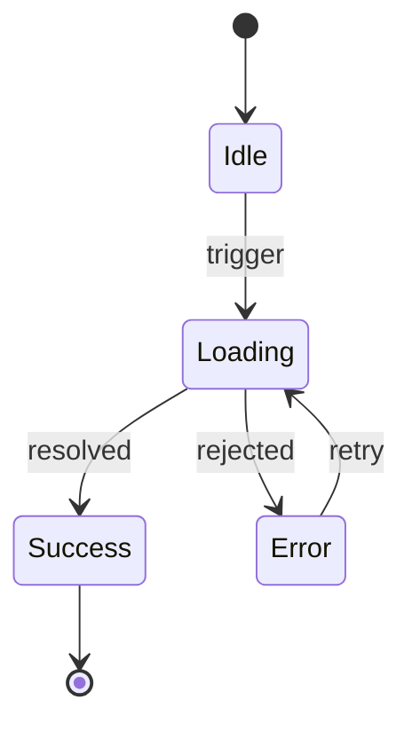
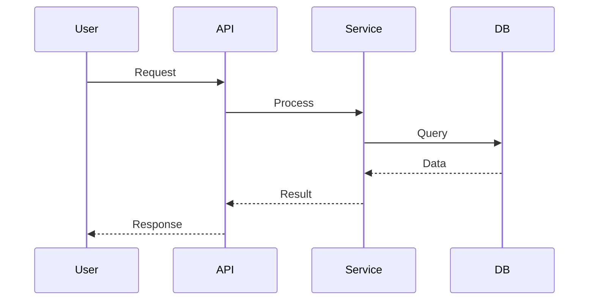
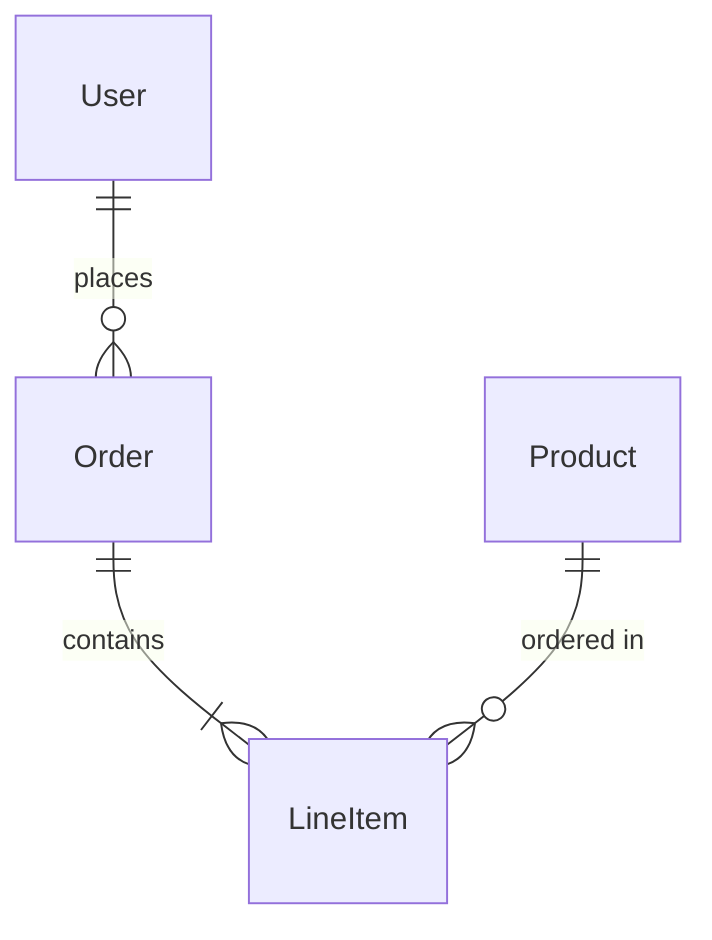

# Agent Prompts for /update-docs

Detailed instructions for each parallel documentation agent.

## Agent 1: High-Level Docs

```
Audit high-level project documentation. Docs should reduce cognitive load.

## README.md
Does it answer a new engineer's first questions?
- What is this? (one sentence)
- Why does it exist? (the problem it solves)
- How do I run it? (Quick Start that actually works TODAY)
- Where do I go next? (pointer to architecture or key modules)

If missing: generate from package.json, code structure.
If Quick Start stale: update with actual working commands.

## ARCHITECTURE.md
Most important doc. Without it, every new reader must reverse-engineer.
- 3-5 major modules/domains (not every file)
- What each owns and DOESN'T own
- Data flow: where enters, where exits
- Deep modules (simple interface, rich behavior)
- Where to start reading code

If missing: CREATE from codebase analysis.

## CLAUDE.md / AGENTS.md
Does it tell an AI assistant how to be effective?
- Key conventions, patterns, anti-patterns
- Commands/workflows, where to find things

## ADR Infrastructure
- docs/adr/ or similar folder with template

Report what you created/updated and WHY it improves understanding.
```

## Agent 2: Module-Level Docs

```
Audit module-level documentation. Apply deep module principle.

Deep modules (good): Simple interface, rich implementation → minimal README needed.
Shallow modules (smell): Complex interface, thin implementation → flag for refactoring OR document extensively.

For each major directory (src/*, lib/*, packages/*, app/*):
- Count exports vs internal logic
- How many files to understand it?
- Clear boundary?

Deep modules without README: create minimal (what it does, entry point, key exports).
Shallow modules without README: create explaining WHY complex, consider flagging for refactor.
Complex modules (10+ files): ensure navigation guide.

Report: which modules got READMEs, which need refactoring not docs.
```

## Agent 3: Decision Records

```
Scan for undocumented architectural decisions.

Record if: future readers will ask 'why?', alternatives were considered, decision constrains future, getting wrong is expensive.

Don't record: obvious choices, easily reversible, implementation details.

Scan git history (last 20 commits): major refactors, new dependencies, pattern changes.
Scan codebase: custom abstractions, unusual structure.

For each significant undocumented decision: create ADR (Context, Decision, Consequences, what was NOT chosen).

Focus: database, auth, API design, state management, build/deploy, major dependencies.

Report: ADRs created, decisions needing user context.
```

## Agent 4: State & Flow Diagrams

```
Audit stateful components and complex flows. Generate Mermaid diagrams.

Diagram if: >3 states, non-linear transitions, error states, async with races.
Don't diagram: simple booleans, linear progressions, XState machines.

Detect: React useState/useReducer with multiple states, Redux slices with status enums, hand-rolled state machines, complex data flows.

Generate Mermaid (stateDiagram-v2, sequenceDiagram, flowchart) near the code.

Focus (high bug potential): auth flows, payment/transaction flows, form submission, real-time/websocket.

Report: diagrams generated, complex flows still undocumented.
```

## Mermaid Templates

### State Machine


### Data Flow


### Entity Relationships

